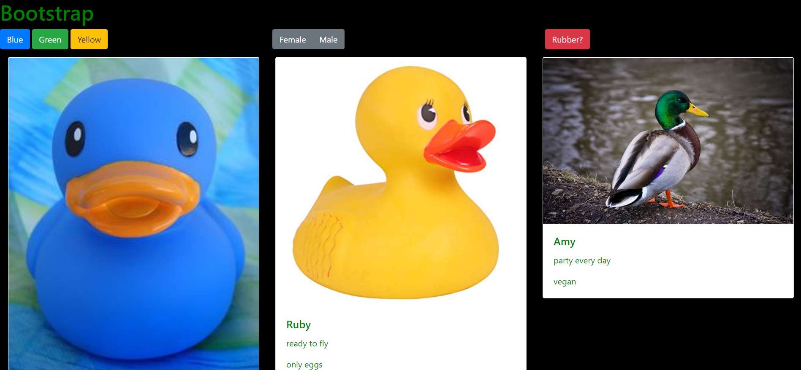

# bootstrap

## Description 
This project is an exploration into the bootstrap grid system. We used bootstrap card to display a collection of ducks (both real and rubber). We also gave our users the ability to filter the ducks by color, gender, and if the ducks are rubber.

## Screenshots

## How to Run
1. Clone down this repo
2. Make sure you have http-server installed via npm. If not get it
[HERE](https://www.npmjs.com/package/http-server)
3. On your command line run `hs -p 8080`
4. In your browser go to `https://localhost:8080`
